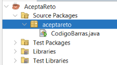
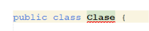
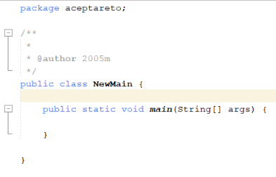

# Creación de clases
En este documento se explica que es una clase y que necesitamos para crearla.
## ¿Qué es una clase?
Una clase es una **plantilla o molde** que se usa para crear **objetos**, definiendo sus datos (**atributos**) y comportamientos (**metodos**).
## Inicio de una clase
Para iniciar un programa en java disponemos de varias partes, lo primero que realizaremos será indicar al paquete que pertenece la clase `package nombreDelPaquete`
En la siguiente imagen aparece cual sería el paquete.



A continuación deberemos indicar que estamos creando una clase `encapsulacion class nombreDeClase`.



## Crear un main
Para que una clase disponga de un codigo que se pueda ejecutar inicialmente, necesitamos crear un metodo **main**, Java aporta su propia estructura para este metodo. Al darle a iniciar la app se ejecutara siempre este codigo y será este el que llame a los demas metodos.

```Java
public static void main(String args[]){}
```

## Ejemplo de clase main

